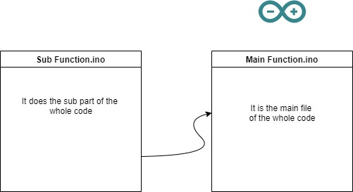

# Name of the Project

A brief description of what this project does and who it's for


## 💻 Tech Spec

 


## 🛠 Components Used

- Arduino Uno
- Sonar
- Jetson Nano

## ⚡ File Structure




## 🚀 How to Start

Install Arduino CLI


```bash
  python3 main.py
```

## 🖍📐 Schematics


## 📝 Blog or Tutorial

 - [How to make a Rocket]()


## 🎓📚 Resources

- [How to make a Rocket]()

## 🏆 Contributors 

|      Name 🎖️    |     Social Media 👋    | GitHub     :octocat: |
|:-------------:|:-------------------|------------------|
| Person1 |  :mortar_board: [LinkedIn]() | [@Person1]()  |
| Person2       | :mortar_board: [LinkedIn]() | [@Person2]()      |
| Person3  |  :mortar_board: [LinkedIn]() | [@Person3]()      |

